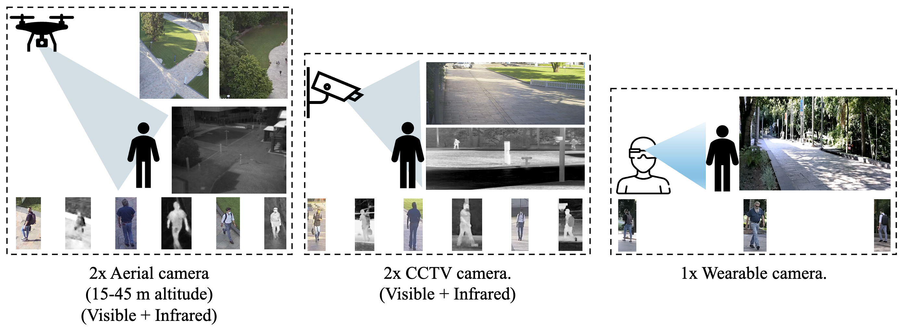

<div align="center">
<h1>AG-VPReID.VIR: Bridging Aerial and Ground Platforms for Video-based Visible-Infrared Person Re-ID</h1>


**IJCB 2025**



AG-VPReID.VIR is the first aerial-ground cross-modality video-based person Re-ID dataset, capturing 1,837 identities across 4,861 tracklets (124,855 frames) using both UAV-mounted and fixed CCTV cameras in RGB and infrared modalities.

[paper](#) | [dataset](https://drive.google.com/drive/folders/1Iy814PqWjwIZcv6CZpieFju-Dop9Y2G7?usp=share_link)
</div>

## Key Features

- **First cross-platform cross-modality dataset** for person Re-ID combining aerial-ground perspectives with RGB-IR modalities
- **Comprehensive collection** with 1,837 identities, 4,861 tracklets, and 124,855 frames
- **Multiple platforms** including UAVs (at various altitudes: 15m, 25m, 45m), CCTV cameras, and wearable devices
- **Multi-modal imagery** with synchronized RGB and IR captures, enabling 24-hour surveillance capabilities
- **Real-world challenges** including cross-viewpoint variations, modality discrepancies, and temporal dynamics

## TCC-VPReID Framework

We propose TCC-VPReID (Three-stream architecture for Cross-platform Cross-modality Video-based Person Re-ID), a novel architecture specifically designed for RGB-IR aerial-ground person Re-ID:

1. **Style-Robust Stream** for handling appearance variations across platforms via style augmentation and graph learning
2. **Memory-based Cross-View Stream** for bridging aerial-ground perspectives with view-specific memory representations
3. **Intermediary-Guided Temporal Stream** for addressing RGB-IR modality gaps through anaglyph data as an intermediary

## Performance

### Comparison with State-of-the-Art Methods (Ground-to-Ground RGB-IR Setting)

| Method | HITSZ-VCM<br>(I2V: R1/mAP) | HITSZ-VCM<br>(V2I: R1/mAP) | BUPTCampus<br>(I2V: R1/mAP) | BUPTCampus<br>(V2I: R1/mAP) | AG-VPReID.VIR<br>(I2V: R1/mAP) | AG-VPReID.VIR<br>(V2I: R1/mAP) |
|:---:|:---:|:---:|:---:|:---:|:---:|:---:|
| SAADG | 69.22/53.77 | 73.13/56.09 | 55.76/53.42 | 57.83/54.82 | 13.07/18.75 | 11.82/21.14 |
| CST | 69.44/51.16 | 72.64/51.16 | 54.92/52.87 | 56.35/53.26 | 14.23/19.37 | 12.64/22.05 |
| AuxNet | 51.05/45.99 | 54.58/48.70 | 66.48/64.11 | 65.23/62.19 | 15.70/16.46 | 12.89/22.57 |
| **TCC-VPReID** | **72.16/56.43** | **75.92/57.84** | **69.73/67.25** | **68.47/65.38** | **36.18/41.56** | **46.33/59.23** |

### Cross-Platform Results on AG-VPReID.VIR

| Setting | I2V<br>(R1/mAP) | V2I<br>(R1/mAP) |
|:---:|:---:|:---:|
| Aerial → Ground | 19.83/22.61 | 46.54/59.69 |
| Ground → Aerial | 34.23/45.62 | 31.52/42.92 |
| Aerial → Aerial | 21.84/30.92 | 33.91/44.72 |
| Ground → Ground | 36.18/41.56 | 46.33/59.23 |

## Dataset Access

The AG-VPReID.VIR dataset is available at [Download Link](https://drive.google.com/drive/folders/1Iy814PqWjwIZcv6CZpieFju-Dop9Y2G7?usp=share_link).

## Citation

If you use our dataset or code in your research, please cite our paper:

```bibtex
@inproceedings{nguyen2025agvpreidvir,
  title={AG-VPReID.VIR: Bridging Aerial and Ground Platforms for Video-based Visible-Infrared Person Re-ID},
  author={Nguyen, Huy and Nguyen, Kien and Pemasiri, Akila and Jahan, Akmal and Fookes, Clinton and Sridharan, Sridha},
  booktitle={2025 IEEE International Joint Conference on Biometrics (IJCB)},
  pages={1--8},
  year={2025},
  organization={IEEE}
}
```
